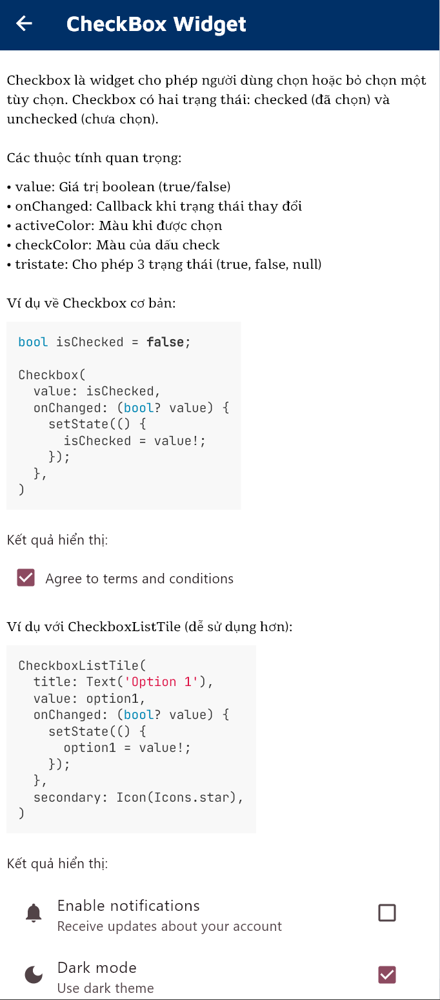

# **Mô Tả**

Bài tập tuần 4 này làm về giao diện tổng hợp một số Component Basic về Flutter, ở đây tổng hợp như Basic, Layout, Button và Animation, với nguồn tài liệu được tham khảo ở nhiều nơi và đa số là ở [**Flutter Widgets Library**](https://api.flutter.dev/flutter/widgets/), ở đây gần như đầy đủ các thư viện mà mình tìm hiểu từ đơn giản tới khó nhất.

Ngoài ra trong các phần Widgets thì có có hiển thị ví dụ code mẫu và lợi khi sử dụng các `Class` nà.

# **Các Hàm Chính**

Trong [**main.dart**](../sourcecode/lib/main.dart): mình đã xây dựng cấu trúc chính cho ứng dụng theo phong cách quản lý danh mục (Dashboard). Điểm bắt đầu của ứng dụng là hàm main() gọi runApp để khởi chạy widget MyApp – nơi mình thiết lập MaterialApp cùng với Theme Material 3 và font chữ GoogleFonts để tạo giao diện hiện đại.

file chính nằm ở class `_MyHomePageState`, mình đã sử dụng widget `Scaffold` kết hợp với `SingleChildScrollView` và `Column` để sắp xếp toàn bộ danh sách các UI Component theo chiều dọc mà không bị lỗi tràn màn hình. Đặc biệt, để mã nguồn sạch sẽ và dễ bảo trì, mình đã chia nhỏ giao diện thành các hàm chức năng như `_buildHeader()`, `_buildSection()` và `_buildCard()`. Trong đó, hàm `_buildCard()` đóng vai trò quan trọng nhất khi sử dụng `Navigator.push` và `MaterialPageRoute` để điều hướng người dùng sang các trang chi tiết của từng component khi nhấn vào.

# **Kết Quả**

**Giao diện chính**
    

**Một số page mẫu**

 _TextPage_
    

 _StaffAreaPage_
    

 _CheckBoxPage_
    

_AnimatedListPage_
    