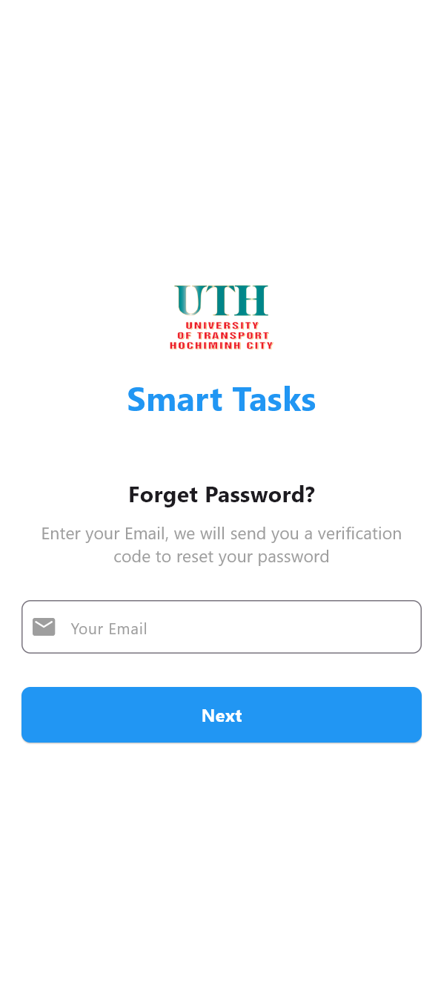
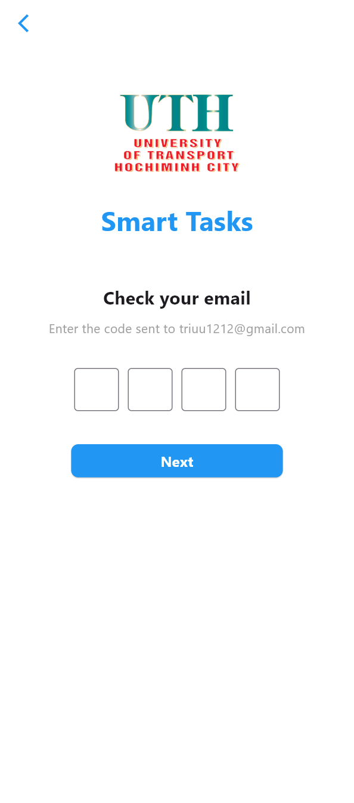
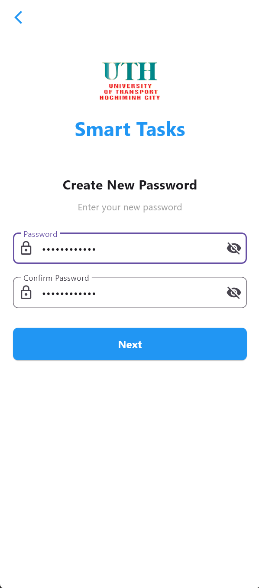
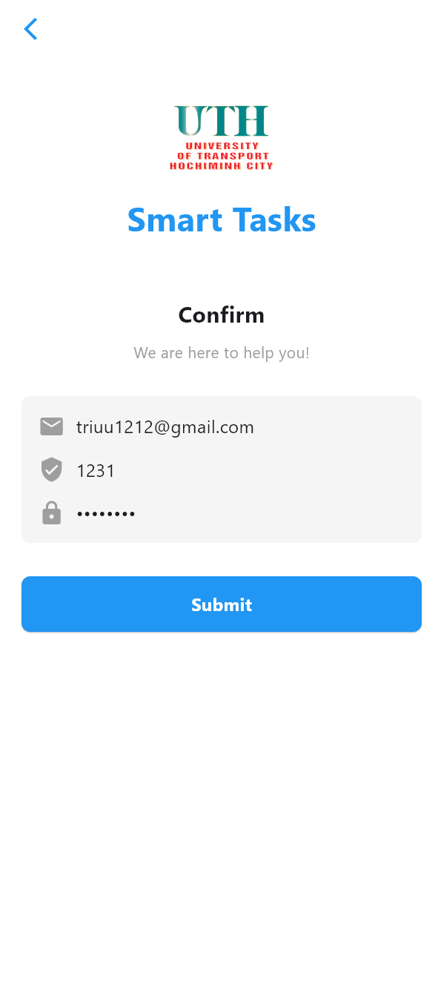

# **Mô Tả**

**Bài tập 3 - Tuần 4** này nói về **data flow navigation** là lưu giữ liệu và chuyền qua các screen khác mà không bị mất, và tạo ra 1 UI đơn giản về việc quên mật khẩu và gửi mã để nhập sau đó thì nhập mật khẩu mới thì sẽ lưu nhớ mật khẩu người dùng mới tạo chứ không phải cái cũ nữa.

# **Các Hàm Chính**

## 1. **Màn hình nhập Email** ([main.dart](../sourcecode_bai3/lib/main.dart))

- **Chức năng**: Người dùng nhập email để yêu cầu đặt lại mật khẩu
- **Widget chính**: `MyHomePage`
- **Data flow**: Truyền `email` sang màn hình tiếp theo khi bấm "Next"
- **Validation**: Kiểm tra email không được để trống

## 2. **Màn hình nhập mã xác thực** ([code_email_page.dart](../sourcecode_bai3/lib/code_email_page.dart))

- **Chức năng**: Nhập mã xác thực 4 số đã gửi về email
- **Widget chính**: `CodeEmailPage`
- **Data flow**:
  - Nhận `email` từ màn hình trước
  - Truyền `email` và `verificationCode` sang màn hình tiếp theo
- **Tính năng đặc biệt**:
  - 4 ô input riêng biệt (\_c1, \_c2, \_c3, \_c4)
  - Tự động chuyển focus khi nhập/xóa số
  - Ghép mã thành chuỗi hoàn chỉnh bằng getter `verificationCode`

## 3. **Màn hình tạo mật khẩu mới** ([new_password_page.dart](../sourcecode_bai3/lib/new_password_page.dart))

- **Chức năng**: Nhập mật khẩu mới và xác nhận lại mật khẩu
- **Widget chính**: `NewPasswordPage`
- **Data flow**:
  - Nhận `email` và `verificationCode` từ màn hình trước
  - Truyền `email`, `verificationCode`, `password` sang màn hình cuối
- **Tính năng**:
  - Ẩn/hiện mật khẩu bằng biến `_obscurePass` và `_obscureConfirm`
  - Kiểm tra 2 mật khẩu phải khớp nhau

## 4. **Màn hình xác nhận** ([confirm_page.dart](../sourcecode_bai3/lib/confirm_page.dart))

- **Chức năng**: Hiển thị tổng hợp thông tin và hoàn tất việc đặt lại mật khẩu
- **Widget chính**: `ConfirmPage`
- **Data flow**:
  - Nhận `email`, `verificationCode`, `password` từ màn hình trước
  - Hiển thị email và mã xác thực (mật khẩu được ẩn dạng ••••)
- **Tính năng**:
  - Nút "Submit" để hoàn tất
  - Quay về màn hình đầu tiên bằng `popUntil((route) => route.isFirst)`

# **Kết Quả**

**Giao diện:**
Giao diện nhập email để gửi mã

Giao diện nhập mã với 4 số

Giao diện nhập và xác thực mật khẩu mới tạo

Giao diện hoàn tất tất cả các bước khi đổi được mật khẩu bị quên

